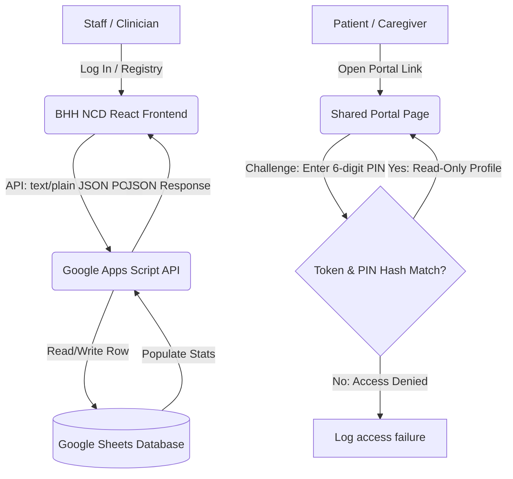

# BHH NCD Profile Patient Monitoring System

**BHH NCD Profile** is a clinical patient monitoring and registry system designed for Bangkok Hospital Hat Yai and private healthcare clinics. It records, visualizes, and monitors patients with chronic non-communicable diseases (NCDs) including DM (Diabetes), HT (Hypertension), Dyslipidemia, CHF (Heart Failure), Stroke, CKD (Kidney Disease), and Gout.

Built as a lightweight, production-ready single-page application (SPA), it deploys to GitHub Pages statically with zero server-side compilation pipelines. It uses **Google Sheets** as a database and a **Google Apps Script Web App** as a secure API gateway.

---

## Technical Stack
- **Frontend**: React (18.3), Vite, TypeScript, TailwindCSS
- **State Management**: TanStack Query (React Query)
- **Forms**: React Hook Form, Zod Validation
- **Charts**: Recharts
- **Icons**: Lucide React
- **Database**: Google Sheets
- **Backend API**: Google Apps Script Web App

---

## Architecture Diagram



---

## Deployment Steps (No-Actions GitHub Pages)

### Step 1: Create Your Google Sheet
1. Create a brand new Google Sheet.
2. Copy the **Spreadsheet ID** from your browser's address bar.
   - E.g. `https://docs.google.com/spreadsheets/d/SPREADSHEET_ID/edit`

### Step 2: Deploy Google Apps Script Web App
1. Open the sheet and navigate to **Extensions** &gt; **Apps Script**.
2. Erase the boilerplate script and paste the content of [apps-script/Code.gs](apps-script/Code.gs).
3. Click the gear icon (**Project Settings**).
4. Scroll to **Script Properties** and add:
   - `SHEET_ID`: (Your copied Spreadsheet ID)
   - `SETUP_KEY`: `Admin123!` (or a custom setup passcode)
5. Click **Save script properties**.
6. Click **Deploy** &gt; **New deployment** at the top right.
7. Click the gear next to "Select type" and choose **Web app**:
   - **Execute as**: `Me (your-email@gmail.com)`
   - **Who has access**: `Anyone`
8. Click **Deploy**, authorize permissions, and copy the generated **Web App URL**.
   - E.g. `https://script.google.com/macros/s/XXXXX/exec`

### Step 3: Run Setup Installer
1. Open the deployed Web App URL in your browser, or trigger it via the login warning configuration setup wizard.
2. Alternatively, perform a manual installer POST request to trigger table setups non-destructively:
   ```json
   {
     "action": "setup.install",
     "sheet_id": "YOUR_SPREADSHEET_ID",
     "setup_key": "Admin123!"
   }
   ```
3. This creates all missing tables and column fields, formats the `patients.hn` column as plain text, freezes header rows, and registers the default administrator user.

### Step 4: Configure Frontend Runtime Config
1. Open [docs/config.js](docs/config.js) in this project.
2. Edit the file to replace the placeholder with your copied Web App API URL:
   ```javascript
   window.BHH_CONFIG = {
     GAS_WEB_APP_URL: "https://script.google.com/macros/s/YOUR_MACRO_ID/exec",
     APP_NAME: "BHH NCD Profile",
     APP_VERSION: "1.0.0"
   };
   ```
3. Save the file.

### Step 5: Build and Upload to GitHub Pages
1. Build the static distribution assets locally:
   ```bash
   npm run build
   ```
   *(This compiles code and copies static outputs into the `/docs` folder).*
2. Commit and push the repository to GitHub.
3. Open your repository's **Settings** &gt; **Pages**:
   - **Source**: Select `Deploy from a branch`.
   - **Branch**: Select `main`.
   - **Folder**: Select `/docs`.
   - Click **Save**.
4. The site is live at: `https://<your-username>.github.io/<your-repository-name>/`

---

## Getting Started

### 1. Default Credentials
- **Email**: `admin@bhh.local`
- **Password**: `Admin123!`

> [!CAUTION]
> Change the default administrator password immediately after initial login. Visit **Users** (Admin view) and click **Reset Pass**.

### 2. HN Formatting Rule
- Hospital Numbers must start with `07` and contain exactly 10 digits.
- The system automatically formats entered values on-the-fly (e.g. `0712345678` becomes `07-12-345678`).

---

## Security & Privacy Notice (PDPA Compliance)

> [!WARNING]
> This application is intended for internal clinical tracing. It does not replace certified hospital EHR/EMR platforms.
> Review local regulations (PDPA/HIPAA) before loading real patient data.

- **Password Safety**: User passwords are encrypted on the server side using SHA-256 with salts; plain-text passwords are never saved.
- **Portals Access**: Sharing links generate unique, cryptographically strong tokens and require a separate 6-digit PIN. Only hash values are recorded. Shared pages show a read-only single-profile dashboard and log access attempts in `profile_access_logs`.
- **Audit Logs**: Every write operation (add/delete/edit) logs the operator's email, target ID, table, and timestamp.
- **Sheet Privacy**: Restrict permissions of your Google Sheet to the deploying account only.
